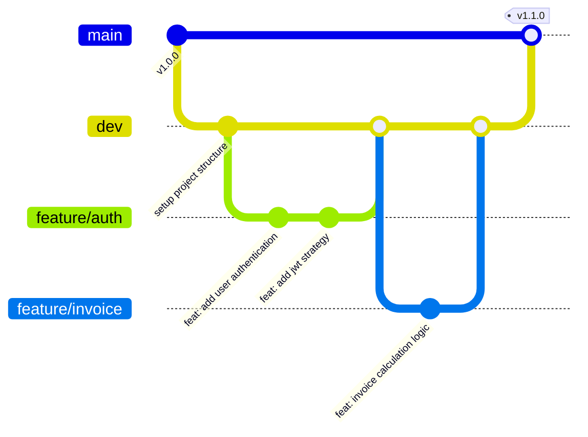

# 🤝 Contributing to Multi-Tenant Invoice SaaS Platform

Thank you for taking the time to contribute! 🎉 We welcome contributions from everyone to help make the **Multi-Tenant Invoice SaaS Platform** robust, scalable, and secure.

Please take a moment to review this document before submitting your pull requests or code changes.

---

## 📌 Table of Contents

- [🌿 Git Branching Strategy](#-git-branching-strategy)
- [🚀 Quick Start & Development Workflow](#-quick-start--development-workflow)
  - [1️⃣ Sync & Switch to dev Branch](#1%EF%B8%8F%E2%83%A3-sync--switch-to-dev-branch)
  - [2️⃣ Create a Feature Branch from dev](#2%EF%B8%8F%E2%83%A3-create-a-feature-branch-from-dev)
  - [3️⃣ Local Project Setup & Development](#3%EF%B8%8F%E2%83%A3-local-project-setup--development)
  - [4️⃣ Commit & Push Changes](#4%EF%B8%8F%E2%83%A3-commit--push-changes)
- [📝 Commit Message Standards](#-commit-message-standards)
- [🚨 Clean Architecture & Multi-Tenant Rules](#-clean-architecture--multi-tenant-rules)
- [🔀 Pull Request Guidelines](#-pull-request-guidelines)
- [📋 Pre-Submission Checklist](#-pre-submission-checklist)
- [💬 Need Help?](#-need-help)

---

## 🌿 Git Branching Strategy

We strictly follow the **`main` ➔ `dev` ➔ `feature/*`** branching pattern to maintain code stability, support smooth code reviews, and automate delivery.

```
       [ main ]          Production-Ready Code (Protected Branch)
          │
          ▼
       [ dev ]           Integration & Active Staging Branch
          │
          ├──► feature/auth          (Feature Branch 1)
          ├──► feature/invoice-pdf   (Feature Branch 2)
          └──► bugfix/jwt-expiry     (Bug Fix Branch)
```

### 📊 Visual Git Workflow



### 🌿 Branch Types & Roles

| Icon | Branch Name | Source | Target | Purpose / Description |
| :---: | :--- | :---: | :---: | :--- |
| 🛡️ | `main` | — | — | **Production Branch.** Contains stable, production-ready code. Protected branch. |
| 🚀 | `dev` | `main` | `main` | **Development Branch.** All active features are merged here before releasing to `main`. |
| ✨ | `feature/*` | `dev` | `dev` | **Feature Branches.** Used for new features (e.g., `feature/auth`, `feature/invoice`, `feature/payment`). |
| 🐛 | `bugfix/*` | `dev` | `dev` | **Bug Fix Branches.** For fixing non-critical bugs found in the `dev` branch. |
| 🚨 | `hotfix/*` | `main` | `main` & `dev` | **Hotfix Branches.** Emergency patches for critical production bugs. |

> [!IMPORTANT]
> **Direct pushes to `main` or `dev` are disabled!** All changes must be made in a feature branch (e.g., `feature/auth`) and submitted via a Pull Request (PR) targeting the `dev` branch.

---

## 🚀 Quick Start & Development Workflow

Follow this step-by-step workflow when working on any task or feature (e.g., `feature/auth`):

### 1️⃣ Sync & Switch to `dev` Branch

Before starting work, make sure your local `dev` branch has the latest upstream changes:

```bash
# 1. Fetch latest updates from remote
git fetch origin

# 2. Switch to dev branch
git checkout dev

# 3. Pull latest commits into dev
git pull origin dev
```

### 2️⃣ Create a Feature Branch from `dev`

Create your topic branch off `dev` using a clear and descriptive name:

```bash
# Pattern: git checkout -b feature/<feature-name>
git checkout -b feature/auth
```

### 3️⃣ Local Project Setup & Development

Make sure dependencies and environment configurations are up to date:

```bash
# Install packages
npm install

# Configure environment variables (if needed)
cp .env.example .env

# Generate Prisma Client & apply migrations
npx prisma generate
npx prisma migrate dev

# Run application in watch mode
npm run start:dev
```

### 4️⃣ Commit & Push Changes

Commit your changes locally following conventional guidelines, then push your feature branch to GitHub:

```bash
# Stage modified files
git add .

# Commit with conventional format
git commit -m "feat(auth): implement user authentication with JWT and RBAC"

# Push feature branch to origin
git push -u origin feature/auth
```

---

## 📝 Commit Message Standards

We enforce **Conventional Commits** via Commitlint and Husky hooks to keep git history clean and meaningful.

### 📐 Format

```
<type>(<scope>): <short description>
```

### 🏷️ Allowed Commit Types

- ✨ **`feat`**: A new feature (e.g., `feat(auth): add google login endpoint`)
- 🐛 **`fix`**: A bug fix (e.g., `fix(invoice): resolve tax calculation rounding error`)
- 📝 **`docs`**: Documentation only (e.g., `docs(contributing): update branching strategy`)
- 🎨 **`style`**: Changes that do not affect code logic (whitespace, formatting, semicolons)
- ♻️ **`refactor`**: Code restructuring without adding features or fixing bugs
- ⚡ **`perf`**: Code changes that improve application performance
- 🧪 **`test`**: Adding missing tests or refactoring existing tests
- 🧹 **`chore`**: Build process, tool updates, or package configuration changes

### 💡 Example Commit Messages

```bash
# ✅ GOOD:
git commit -m "feat(auth): implement RefreshTokenUseCase with Redis storage"
git commit -m "fix(tenant): ensure tenant context middleware intercepts all incoming requests"
git commit -m "docs: enrich CONTRIBUTING.md with dev workflow and icons"

# ❌ BAD:
git commit -m "updated auth"
git commit -m "fixed stuff"
```

---

## 🚨 Clean Architecture & Multi-Tenant Rules

All code contributions must adhere to our core architectural principles:

### 🛡️ 1. Domain Layer Isolation (`src/domain/`)
- ❌ **NEVER** import NestJS modules (`@Injectable()`, `@Controller()`), Prisma Client, or external framework utilities in the domain layer.
- ✅ Domain entities, business rules, and domain events must remain 100% pure and framework-agnostic.

### 🔌 2. Dependency Inversion / Ports & Adapters (`src/application/`)
- ✅ Application use-cases interact with external services via TypeScript interface tokens (Ports).
- ✅ Infrastructure layer implements the concrete adapters (e.g., Prisma repositories, Redis queues).

### 🏢 3. Strict Multi-Tenant Isolation
- 🔒 **EVERY** database query in repositories must filter explicitly by `tenantId`.
- 🛡️ Never expose cross-tenant data! Extract and validate `tenantId` from authenticated token context on every request.

---

## 🔀 Pull Request Guidelines

When your feature branch (`feature/auth`) is complete:

1. 🎯 **Target Branch:** Ensure your Pull Request target branch is set to **`dev`** (Not `main`).
2. 🏷️ **PR Title:** Follow Conventional Commit conventions (e.g., `feat(auth): add auth module with JWT and guards`).
3. 📝 **PR Description:**
   - Summary of changes implemented.
   - Related issue ticket numbers (e.g., `Closes #12`).
   - Instructions for reviewers on how to test the changes.
4. 🤖 **CI Verification:** Verify all linting, formatting, and unit test checks pass in the PR pipeline.

---

## 📋 Pre-Submission Checklist

Before creating a Pull Request, run the following verification checks locally:

- [ ] 🎨 **Linting:** Run `npm run lint` and confirm zero ESLint errors or warnings.
- [ ] 🧹 **Formatting:** Run `npm run format` to ensure Prettier compliance.
- [ ] 🧪 **Unit Tests:** Run `npm run test` to verify all test suites pass.
- [ ] 🏗️ **Build:** Run `npm run build` to ensure project compiles cleanly.
- [ ] 🌿 **Branch Up to Date:** Ensure your feature branch is rebased/merged with the latest `dev` (`git pull origin dev`).

---

## 💬 Need Help?

If you have questions, encounter architectural challenges, or need guidance:

- 💬 Open a GitHub Discussion or Issue.
- 📬 Reach out to the maintainers or team leads.

Happy Coding! 🚀✨
